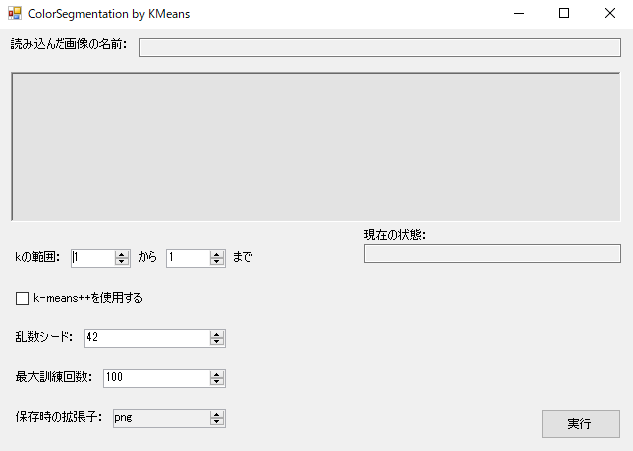
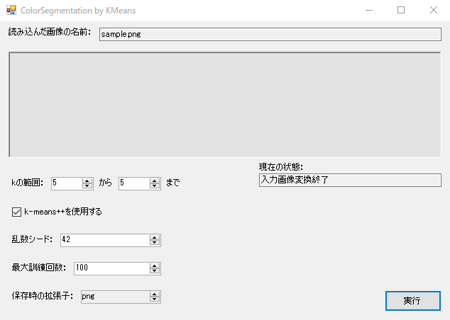
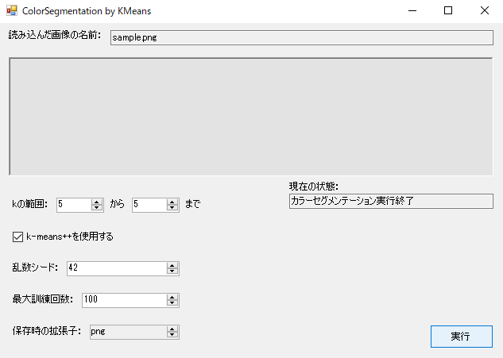

# Color Segmentation By KMeans
k-meansを用いた簡単なカラーセグメンテーションをアプリ（Windows Form Application）に落とし込んだものです．恐らくこれよりもsklearnのKMeansを利用した方がずっと良いです．

## 注意
見よう見まねかつ試行錯誤で作成しているので間違えている部分や不自然な部分などがあると思われます．そのため，ご指摘や注意などございましたら遠慮なくお申し付け頂けると幸いです．

## 参考文献
* Qiita，[k-means++を理解する](https://qiita.com/g-k/items/e1d558ffcdc833e6382c)，[@g-k](https://qiita.com/g-k)
* Hatena Blog，[【C#/Unity】出現率から項目を一つルーレット選択で選ぶ拡張メソッド](https://kanchi0914.hatenablog.com/entry/2019/09/30/054419)，[Kanchi0914](https://kanchi0914.hatenablog.com/about)

## 使用例
ビルドしてできたexeファイルを実行すると次のような画面が出る．

窪んでいるようなパネルに画像をドラッグ・アンド・ドロップすることで画像を読み込ませることができる．この時，変換処理によって固まる場合があるが，補助テキストが今現在何をしているか伝えるようにしているため，その内容を信じて頂きたい（あまりにも巨大なファイルだと本当にクラッシュしている可能性もあるが…）．

今回は，例えば以下のようなsample.pngという画像を読み込ませたとする．

そうして読み込ませて，変換処理が完了した場合は次のような表示になるはずである．ここではkの範囲をデフォルト（1~1）から5~5（すなわち5のみ）にし，k-means++を用いることにしている．

この状態で実行を押すと，補助テキストに「カラーセグメンテーション実行中」のような表示が表れ，（ファイルサイズやkの大きさにもよるが）暫く経つと「カラーセグメンテーション実行終了」という文字に補助テキストが変わる．

exeファイルを置いた（置かれた）ディレクトリを見てみると元画像の名前を冠したサブディレクトリが作成されており，その中に以下のようなsample(k=5).pngが生成されているはずである．
.png)

これがこのアプリの大まかな利用法である．単純ではあるが，色々試すと面白いので各言語で作成すると良いかもしれない（一番望ましく，汎化性に優れているのは恐らくPython×sklearnだと思われるが…）．
